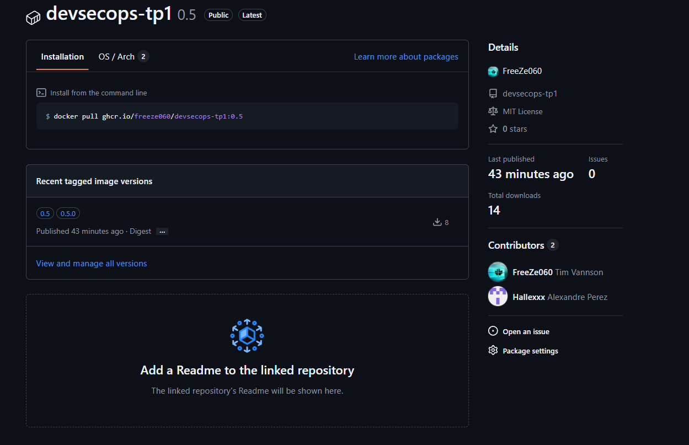
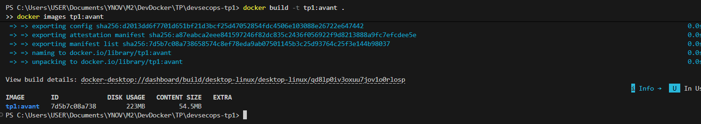
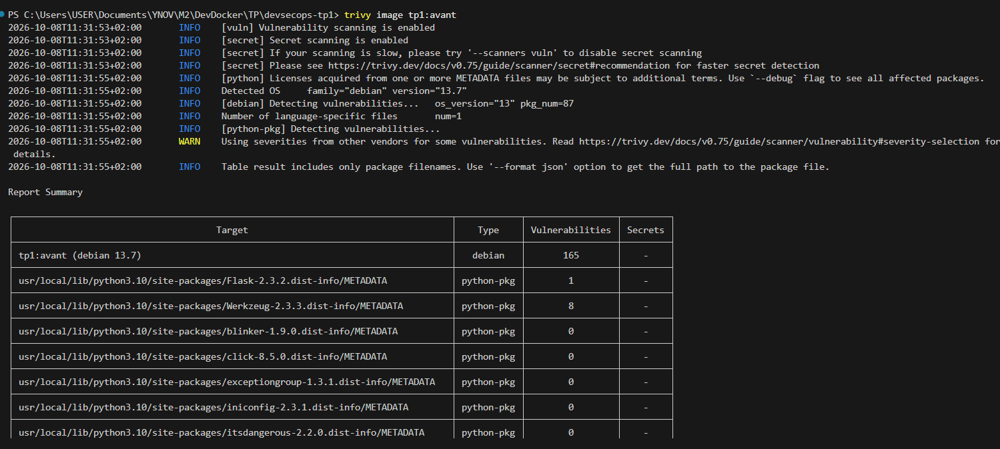
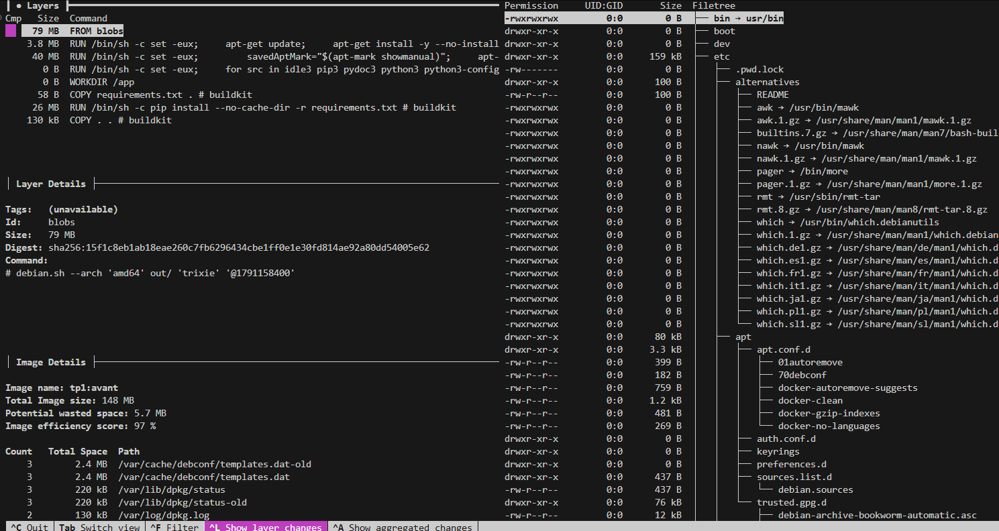
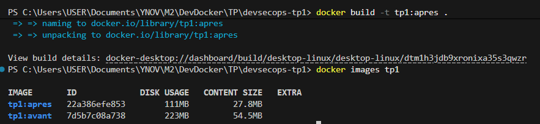
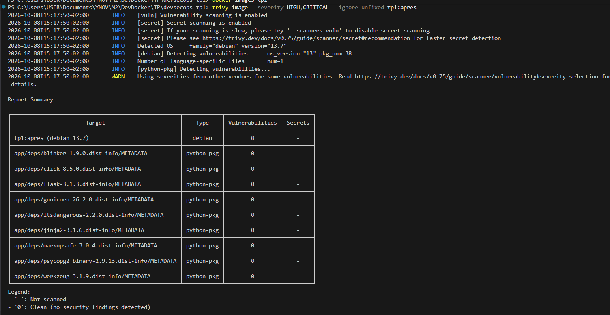
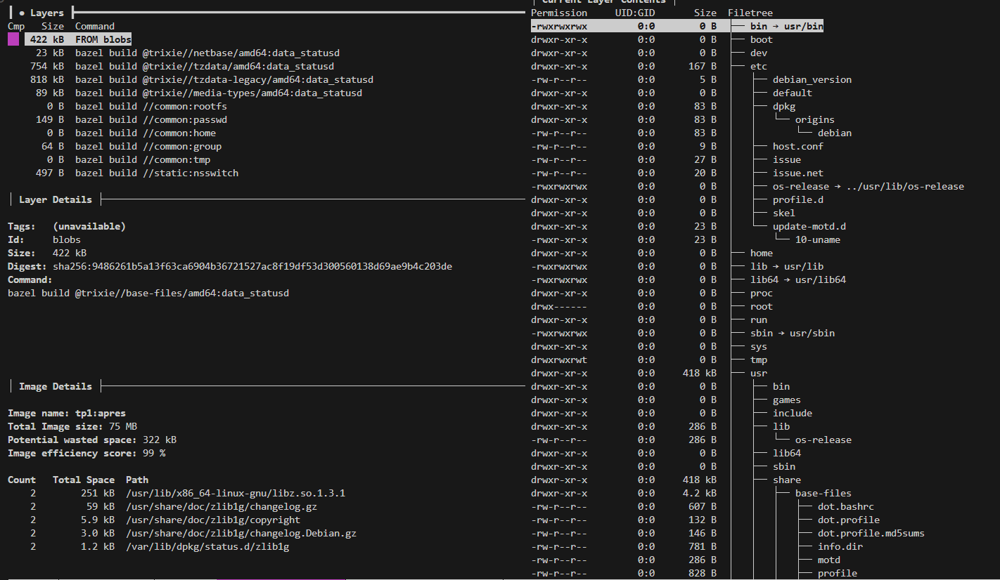
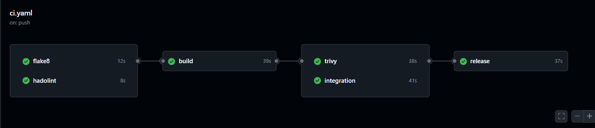

# DevSecOps TP1 — Hardening Flask / PostgreSQL

Binôme : **Tim Vannson** ([@FreeZe060](https://github.com/FreeZe060)) · **Alexandre Perez** ([@Hallexxx](https://github.com/Hallexxx))

## Architecture et livrables

```
hôte :5000 ──► api-python (distroless, UID 65532, gunicorn) ──► db (Chainguard PostgreSQL 18.6)
               réseaux frontend + backend                      réseau backend interne, 5432 non publié
```

| Livrable | Mise en œuvre |
|---|---|
| `Dockerfile` | Multi-stage : builder `python:3.13.16-slim-trixie` → runtime `distroless/python3-debian13:nonroot`, épinglés par digest, `USER 65532:65532`, `CMD` en forme JSON |
| `docker-compose.yml` | PostgreSQL Chainguard par digest, réseau `backend` interne, `depends_on: service_healthy`, healthchecks exec, service `tests` (profil `test`) |
| `requirements.txt` | Flask 3.1.3, Werkzeug 3.1.9, psycopg2-binary 2.9.13, gunicorn 26.2.0 — 0 CVE |
| `.dockerignore` | Liste blanche : tout est exclu sauf `app.py` et `requirements.txt` |
| `.hadolint.yaml` | Seuil `warning`, registres `docker.io`/`gcr.io`/`cgr.dev`/`ghcr.io`, DL3002/DL3006/DL3007/DL4006 en `error` |
| `.github/workflows/ci.yaml` | flake8 → hadolint → build + Dive → Trivy / intégration → release GHCR |

## 1. Liens publics des packages GHCR

Package : **https://github.com/FreeZe060/devsecops-tp1/pkgs/container/devsecops-tp1**



```bash
docker pull ghcr.io/freeze060/devsecops-tp1:0.5.0
docker pull ghcr.io/freeze060/devsecops-tp1:0.5
docker run -d --name tp1 -p 5000:5000 ghcr.io/freeze060/devsecops-tp1:0.5.0
curl http://localhost:5000/health
```

Stack complète : `cp .env.example .env`, `docker compose up -d --build --wait`, puis
`docker compose --profile test run --rm tests` et `docker compose --profile test down -v`.

## 2. Tableau comparatif Avant / Après

| Critère | Avant (`python:3.10-slim`) | Après (distroless) |
|---|---|---|
| Poids (`docker images`) | 223 Mo | **111 Mo** |
| Utilisateur d'exécution | root (UID 0) | **UID 65532** |
| Shell | présent (`sh`, `bash`) | **absent** |
| CVE Trivy totales | 185 (dont 20 Python) | 159 (dont **0 Python**) |
| CVE HIGH/CRITICAL corrigibles | 3 | **0** |
| Efficience Dive | 97,36 % | **99,78 %** |

Les 159 CVE restantes concernent les bibliothèques Debian 13 nécessaires à Python (`libc6`,
`libexpat1`, `libpython3.13`…) et n'ont **aucune version corrigée publiée** : la barrière
« vulnérabilité corrigible HIGH/CRITICAL » est respectée.

| | Taille | Trivy | Dive |
|---|---|---|---|
| **Avant** |  |  |  |
| **Après** |  |  |  |

## 3. Justification des images de base

- **Runtime `gcr.io/distroless/python3-debian13:nonroot`** : choix Distroless imposé, sans shell,
  compilateur ni gestionnaire de paquets ; Debian 13 = Python 3.13 ; variante `nonroot` (UID 65532).
- **Builder `python:3.13.16-slim-trixie`** : même Python mineur (3.13) et même Debian que le runtime,
  indispensable pour `psycopg2-binary` (code compilé `cp313`/glibc). Il contient pip, absent du runtime.
- **PostgreSQL `cgr.dev/chainguard/postgres@sha256:0c4eaf6c…`** : image Chainguard imposée, PostgreSQL 18.6.

**Immuabilité** : chaque image est référencée par `tag@sha256:digest` (Docker n'utilise que le digest),
les dépendances Python par `==`, les actions GitHub par SHA de commit. Aucun tag `latest`.

**Dockerfile** : `requirements.txt` est copié et installé avant `app.py` (cache préservé quand le code
change), `pip install --no-cache-dir --no-compile --target /install`, seuls `/install` et `app.py`
sont copiés via `COPY --from=builder`. Aucun `ADD`, aucun `cd`, `SHELL` avec `-o pipefail`.

## 4. Résolution des contraintes sans shell

Distroless et Chainguard n'ont ni `curl` ni forme `CMD-SHELL` : les sondes sont en **forme liste exec**.

```yaml
api-python:
  healthcheck:
    test: ["CMD", "python3", "-c", "import urllib.request; urllib.request.urlopen('http://127.0.0.1:5000/health', timeout=3)"]
db:
  healthcheck:
    test: ["CMD", "pg_isready", "-h", "127.0.0.1", "-U", "${POSTGRES_USER}", "-d", "${POSTGRES_DB}"]
```

- **API** : le seul exécutable disponible est Python ; `urllib.request` (bibliothèque standard) appelle
  `/health`. Une erreur lève une exception → code de sortie 1 → `unhealthy`.
- **PostgreSQL** : `pg_isready`, utilitaire client fourni par l'image. `-h 127.0.0.1` force un test TCP :
  le serveur temporaire d'initialisation n'écoute pas sur le réseau, la sonde n'est donc `healthy`
  qu'une fois le vrai serveur prêt.
- **Amorce** : `depends_on: db: condition: service_healthy` → l'API attend la base.

## 5. Journal des remédiations de dépendances & qualité

**Flake8** : le code d'origine respecte le `.flake8` fourni (exit 0). Ses écarts (`E302`, `W293`,
`W391`) font partie des règles explicitement ignorées par la configuration : aucune correction requise.

**CVE du `requirements.txt` d'origine** (`trivy fs`) :

| Paquet | CVE | Sévérité |
|---|---|---|
| Werkzeug 2.3.3 | CVE-2024-34069 | HIGH |
| Werkzeug 2.3.3 | CVE-2023-46136, CVE-2024-49766, CVE-2024-49767, CVE-2025-66221, CVE-2026-21860, CVE-2026-27199, CVE-2026-102598 | MEDIUM |
| pytest 7.4.0 | CVE-2025-71176 | MEDIUM |
| Flask 2.3.2 | CVE-2026-27205 | LOW |

| Paquet | Avant → Après | Justification |
|---|---|---|
| Werkzeug | 2.3.3 → 3.1.9 | Plus haute version corrigée requise, corrige les 8 CVE |
| Flask | 2.3.2 → 3.1.3 | Corrige CVE-2026-27205, requis par Werkzeug 3.x |
| psycopg2-binary | non épinglé → 2.9.13 | Reproductibilité, compatible Python 3.13 / PostgreSQL 18 |
| gunicorn | ajouté (26.2.0) | Serveur WSGI de production au lieu du serveur de développement Flask |
| pytest | 7.4.0 → 9.1.1, déplacé dans `requirements-dev.txt` | Corrige CVE-2025-71176, hors de l'image de production |

Compatibilité vérifiée : `/health`, `/hello`, `/dbtest` OK contre PostgreSQL 18.6, 3 tests pytest réussis.

## 6. Sécurisation de la chaîne CI/CD

Déclenchement sur `push` et `pull_request` vers `main`, et sur les tags `v*.*.*`.

| Job | Bloque si |
|---|---|
| `flake8` | violation non ignorée par `.flake8` |
| `hadolint` | avertissement avec `.hadolint.yaml` |
| `build` | build BuildKit, puis Dive `--ci --lowestEfficiency=0.8` < 80 % |
| `trivy` | `image` et `fs` : HIGH/CRITICAL corrigible (`--ignore-unfixed --exit-code 1`) |
| `integration` | `compose up --wait --wait-timeout 120`, `/health`, `/dbtest`, pytest ; `down -v` en `if: always()` |
| `release` | uniquement sur tag `v*.*.*` et après succès de `trivy` et `integration` |

- **Permissions** : `permissions: {}` au niveau du workflow, `contents: read` par job, `packages: write`
  uniquement sur `release`. Connexion GHCR avec `GITHUB_TOKEN`, sans secret personnel.
- **Pinning SHA** : toutes les actions par SHA de commit (ex. `actions/checkout@3d3c42e5…` = v7.0.1,
  `docker/build-push-action@c3c9e263…` = v7.4.0). Un tag `@v7` est mobile, un SHA est immuable.
  Hadolint, Dive et Trivy tournent en image Docker version + digest.
- **SemVer** : tag Git `vX.Y.Z` → tags d'image `X.Y.Z`, `X.Y` et `X` via `docker/metadata-action`
  (`X` non publié pour les versions `0.x`), `latest` désactivé.

## 7. Preuves d'exécution

```
$ python -m flake8 .                                    → exit code 0
$ hadolint --config .hadolint.yaml Dockerfile           → exit code 0

$ dive --ci --lowestEfficiency=0.8 ghcr.io/freeze060/devsecops-tp1:0.5.0
  efficiency: 99.7845 %   wastedBytes: 322 kB
  PASS: lowestEfficiency  Result:PASS

$ trivy image --severity HIGH,CRITICAL --ignore-unfixed --exit-code 1 ghcr.io/freeze060/devsecops-tp1:0.5.0
  debian 13.7 : 0   flask / werkzeug / gunicorn / psycopg2 … : 0   → exit code 0

$ docker compose ps
  api-python   Up (healthy)
  db           Up (healthy)
$ curl http://localhost:5000/dbtest   → {"db_connection":"successful"}

$ docker compose --profile test run --rm tests
  test_app.py::test_health PASSED
  test_app.py::test_hello PASSED
  test_app.py::test_dbtest PASSED      3 passed

$ docker pull ghcr.io/freeze060/devsecops-tp1:0.5.0   (sans authentification)
  Digest: sha256:a35004c0c18fe07dbdace1f94592715605e0e4e0686972fbda8e229a4c3811a2
  tags publiés : 0.5.0, 0.5
```

Pipeline du tag `v0.5.0`, 6 jobs en succès dont `release` (https://github.com/FreeZe060/devsecops-tp1/actions/runs/37777527100) :


